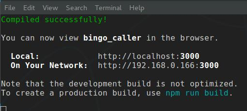

***
# Bingo caller

Simple bingo caller : shuffles the numbers and draws them 1 by 1.

***
## HOW-to
***

After starting the app..

1. Set a delay between the calls using the arrow buttons
2. Click on the '**GO**' button
3. Use the '**PAUSE**' button to temporary halt the game. <u>You can pause a round to adjust the delay between calls</u>. Click on '**GO**' to restart the caller!

At anytime, during an active round, you can use the '**END ROUND**' and '**CANCEL**' buttons. **END ROUND** terminates the round and waits for you to reset the screen. It also displays some stats about the round. **CANCEL** terminates the round and resets the screen; ready for a new round, instantly!

***
## INSTALL
***
To install and use the Bingo caller, you need **npm**, the Node Package Manager.

1. Clone the folder
2. Install dependencies; run, from the clone folder

``` 
npm install
```

3. Use the app.

***
#### **IF YOU RUN A HTTP SERVER SUPPORTING REACT**
***

* run the app builder

``` 
npm run build
```

* Once the process is over..

``` 
cd build
```

* ..and copy the entire content to your HTTP server folder.

***
#### **IF YOU DO NOT RUN A HTTP SERVER**
***
..just run one! :P

Run the following command :

``` 
npm run start
```

That will start a development server on your local machine. This is not the best, but it allows to run it. It should open automatically - *after about a minute* - your default browser on one of the following addresses : [http://localhost:3000](http://localhost:3000) or [http://127.0.0.1:3000](http://127.0.0.1:3000). If it doesn't, try to open one of the link manually when you see a screen similar to this



## SHUFFLING

The shuffling is done using Javascript Math.random() function. All numbers are originally listed in order, from 1 to 75, in an array. The algorithm goes this way :

1. two different numbers from 0 to 74 are chosen randomly
2. In the array, the numbers located at the positions are simply switched
3. this process is repeated 225 times.

Credits : Special Thanks to
* BuGee <small>(*Twitch*)</small> for helping with the shuffling algorithms and moral support.
* caLLowCreation <small>(*Twitch*)</small> for letting me post on his Discord server for help.
* Kottikärry <small>(*Discord*)</small> for helping understanding JS and React.
* MooFee <small>(*Twitch*)</small> for helping with the hardest of the CSS.


***
***
***
# Getting Started with Create React App

This project was bootstrapped with [Create React App](https://github.com/facebook/create-react-app).

## Available Scripts

In the project directory, you can run:

### `npm start`

Runs the app in the development mode.\
Open [http://localhost:3000](http://localhost:3000) to view it in the browser.

The page will reload if you make edits.\
You will also see any lint errors in the console.

### `npm test`

Launches the test runner in the interactive watch mode.\
See the section about [running tests](https://facebook.github.io/create-react-app/docs/running-tests) for more information.

### `npm run build`

Builds the app for production to the `build` folder.\
It correctly bundles React in production mode and optimizes the build for the best performance.

The build is minified and the filenames include the hashes.\
Your app is ready to be deployed!

See the section about [deployment](https://facebook.github.io/create-react-app/docs/deployment) for more information.

### `npm run eject`

**Note: this is a one-way operation. Once you `eject`, you can’t go back!**

If you aren’t satisfied with the build tool and configuration choices, you can `eject` at any time. This command will remove the single build dependency from your project.

Instead, it will copy all the configuration files and the transitive dependencies (webpack, Babel, ESLint, etc) right into your project so you have full control over them. All of the commands except `eject` will still work, but they will point to the copied scripts so you can tweak them. At this point you’re on your own.

You don’t have to ever use `eject`. The curated feature set is suitable for small and middle deployments, and you shouldn’t feel obligated to use this feature. However we understand that this tool wouldn’t be useful if you couldn’t customize it when you are ready for it.

## Learn More

You can learn more in the [Create React App documentation](https://facebook.github.io/create-react-app/docs/getting-started).

To learn React, check out the [React documentation](https://reactjs.org/).

### Code Splitting

This section has moved here: [https://facebook.github.io/create-react-app/docs/code-splitting](https://facebook.github.io/create-react-app/docs/code-splitting)

### Analyzing the Bundle Size

This section has moved here: [https://facebook.github.io/create-react-app/docs/analyzing-the-bundle-size](https://facebook.github.io/create-react-app/docs/analyzing-the-bundle-size)

### Making a Progressive Web App

This section has moved here: [https://facebook.github.io/create-react-app/docs/making-a-progressive-web-app](https://facebook.github.io/create-react-app/docs/making-a-progressive-web-app)

### Advanced Configuration

This section has moved here: [https://facebook.github.io/create-react-app/docs/advanced-configuration](https://facebook.github.io/create-react-app/docs/advanced-configuration)

### Deployment

This section has moved here: [https://facebook.github.io/create-react-app/docs/deployment](https://facebook.github.io/create-react-app/docs/deployment)

### `npm run build` fails to minify

This section has moved here: [https://facebook.github.io/create-react-app/docs/troubleshooting#npm-run-build-fails-to-minify](https://facebook.github.io/create-react-app/docs/troubleshooting#npm-run-build-fails-to-minify)
# BingoCaller
